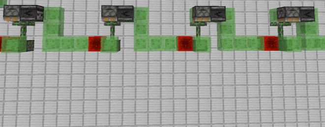
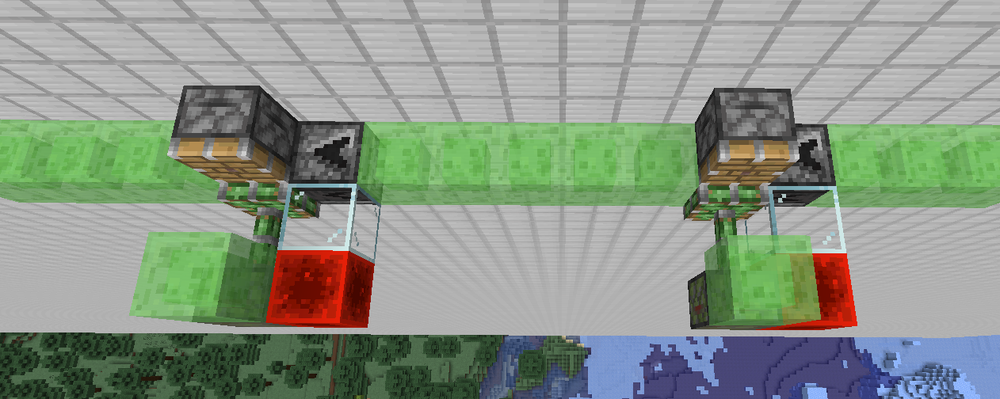

# #31 连杆

---

让好大一坨东西同时移动是个很麻烦的事, 因为活塞12的推力上限, 我们只能使用后多个活塞把`能动`传过去, 但这样我们不得不仔细调整延时, 且传递越远, 延时越复杂.

因此, 我们有了`无延时连杆`的概念. 本节我们将介绍几种应用不同原理的连杆. 

## 3.1.1 基于活塞收回的单向连杆

粘性活塞链收回是无延时的.

实际上粘性活塞无论伸出还是收回, 都会立即响应. 这时被推动/拉动的方块瞬间转换为`b36`, 4gt后运动完成方块再转换回真正的方块.

只不过对于活塞链, 如果是伸出, 那么只有在方块移动且到位后, 才会激活下一个活塞, 因此每个活塞都会多出一部分时间.

但缩回完全不同, 红石块变成`b36`的瞬间, 便意味着信号消失, 前面的活塞将立即响应, 因此活塞链收回不会产生延时.

我们修改一下, 让活塞主动伸出.

如图所示, 我们让活塞收回后自动伸出, 这时即可保证整个活塞链的同步.

根据这个原理, 我们应用到`飞行器`中, 也就是前面提到的`半动机`:

图中每个结构单元, 使用向上的粘性活塞进行无延时信号传递, 同时挂载一个向下的普通活塞, 用于将粘性活塞归位.

这便是最常见的连杆结构, 同理我们可以做出好多相同结构的连杆.

_图为`ilmango`世界吞噬者轰炸机一侧的停靠架, 本质上就是一个连杆挂载了几个侦测器和活塞_

_图为`星空花夜、`连发盾构机的一根连杆, 该连杆为水平运动, 但原理无异_

## 3.1.2 基于活塞收回的连杆拓展

## 3.1.3 基于活塞bud的连杆

## 3.1.4 其他连杆
