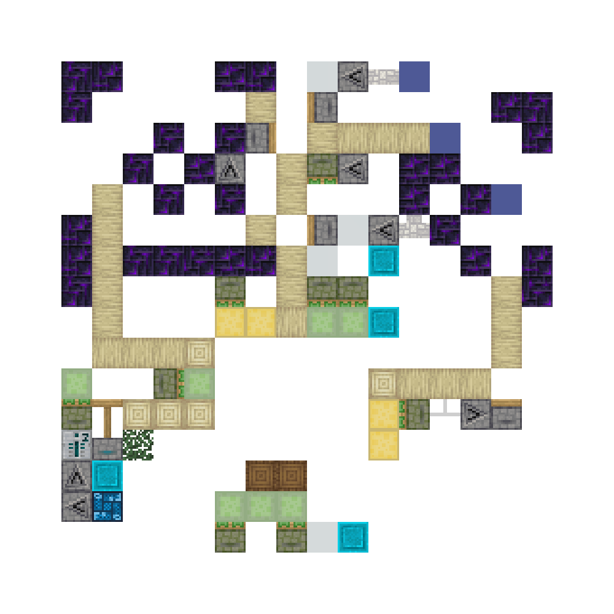
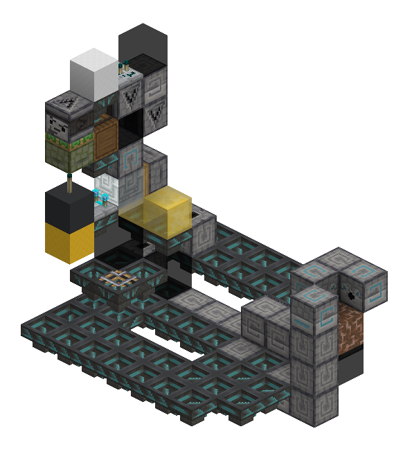
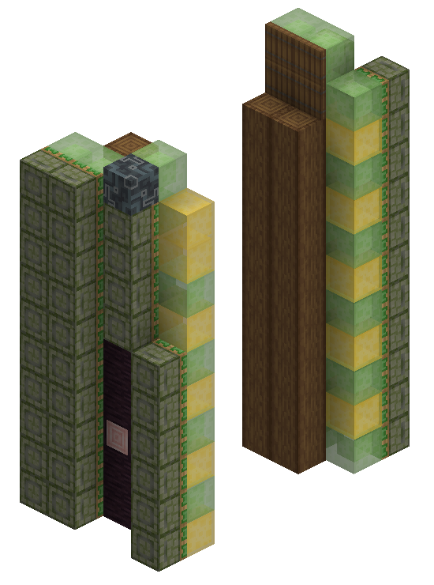
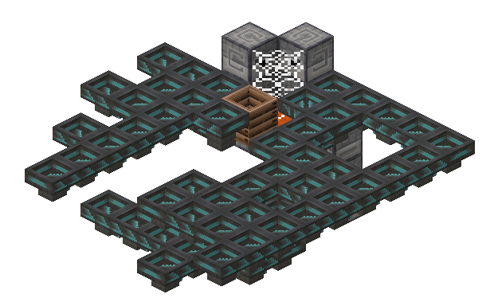
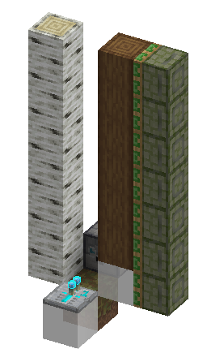
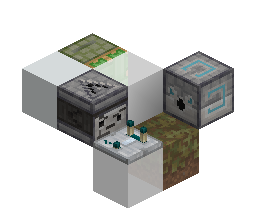
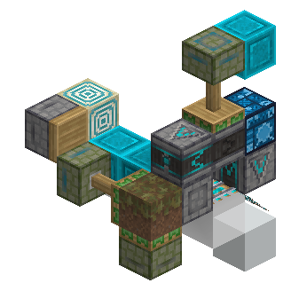
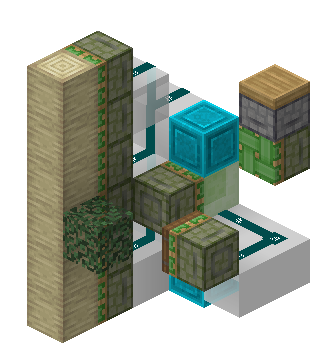
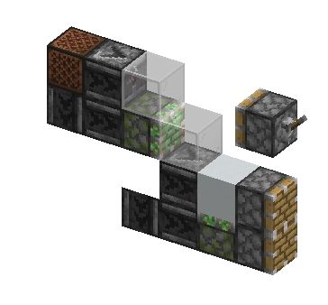

# 02-从零开始设计一台最简单的树场

树场的设计流程一般分为**架构设计**和**布线**。这里我们以一台非常简单的白桦树场为例，带大家从零开始设计一台树场。

## 2.1 架构设计

**架构**，在树场中一般指代树场结构的**特定排布方式**，一般而言可以分为**核心架构**和**处理架构***即方块流转掉落物模块的架构设计*

核心架构：

@Chuo_di

处理架构:

@Chuo_di

核心架构一般包含**催熟架构**,

**树干处理架构**,

**树叶处理架构**,

和**树苗循环架构**，

一般先设计**催熟结构**或**树干处理架构**，再设计**树叶处理架构**和**树苗循环架构**

树干处理架构的基本形式已经在上一章阐述，这里我们主干处理选用**直推**（*采用推出结构的主干处理会被称为“主推”*），根部与主干一同处理。催熟架构选用**单发射器**。

一般而言，我们不希望处理周期长于4gt的树场使用时钟激活。因此我们需要引入**检测**结构，用于检测树木的生长，并触发树场的机械结构

检测的基本方式有：**比较器检测**、**QC检测**、**BUD检测**、**推动上限检测**

比较器检测：

QC检测：

BUD检测（这里BF偷懒了直接使用树叶检测了）：

推动上限检测：

这里我们采用QC检测。QC检测的基本原理是，由于树干是可充能的，树苗长成后，树根被充能，于是侧下方的活塞被QC。只需要给它更新，它就会推出，从而触发树场的处理结构

>虽然暂时我们还不会引入，但推动上限检测是目前最重要的检测方式。在这一章之后，几乎所有我们分析的检测式树场设计都使用了推动上限检测，值得读者注意

树叶处理架构而言，白桦只需要20个树叶，因此简单的活塞墙就能满足需求。由于活塞很卡，这里我们改为粘有活版门和铁链的**蜜绿墙***这样可以增加树苗飞溅的空间，从而保持较少的树叶处理量并很大程度上避免漏斗矿车的使用*

>未经优化的械电设计带来的卡顿相当大，其中的最大头之一就是活塞，希望读者随时注意能否减少树场中的活塞（另一个最大头是红石粉，我们会在另外的章节叙述减少红石粉的方法）

>对于更复杂的树场，设计核心架构的同时也要同时设计架构运行的时序。这里我们暂时忽略它，留到侧枝树处理再做具体讨论

树苗循环架构而言，我们用漏斗铺满树场的底部，并连接到一个投掷器上。玩家挂机时站在这个投掷器旁边，就可以拿到树场回收的树苗。另外，我们将核心周围围起来，避免树苗飞溅范围过大

处理架构，我们采用一个简单的**TNT爆炸室**

>值得注意的是，由于目前的高速全树种有多个原木方块流输出，处理架构也会非常复杂，我们会在对PUTF std2的分析中讨论对这些情况一般的设计思路。

## 2.2 布线

基本思路就是在不影响树场时序的前提下，将树场的各个部分连接起来

首先，我们为催熟发射器和树苗投掷器接上**4gt时钟**

接着使用红石粉激活各部分的活塞

对于TNT爆炸室，我们随便放一个**TNT复制**，为了减少空间的占用，我们使用水流**缓存TNT**，并用水流汇聚掉落物

到这里，一台最基本的树场就设计完成了。如果你没有参考插图，这可以说是你设计的第一台树场。现在尝试分析一下它的时序？

>时序分析是对树场最基本的分析方式。通过架构与布线读出树场的运行时序是每个树场人必备的基本素养。

基于以上阐述的设计过程，你可以设计出最快6gt周期的白桦树场。[[这是一个参考设计|TreeFarm/exampleworld/#02 从零开始设计一台最简单的树场.zip]]~~懒狗星河没做卸货器好孩子不要学哦~~