# 03 尝试设计一台全树种树场

在上一节中，我们已经完成了一台最简单的树场。但这台树场有个很严重的问题：只能处理白桦树，而对于其他树种无能为力。为了解决这个问题，这一节我们尝试设计一台全树种树场。

## 3.1 核心架构设计

对于全树种树场，我们需要架构能够满足**所有需要处理的树种**的生长需求。这意味着**取并集**，我们需要在架构设计的某个方面上满足**要求最高的树种**的要求。这里我们暂时只涉及最传统的五个树种：**白桦 橡树 丛林 云杉 金合欢**。我们按照设计的一般顺序，逐一讲解。

其中白桦是生长限制最小的树种，我们从云杉开始。

<!--这部分记得加图-->

### 3.1.1 云杉架构要求

云杉要求以树苗为中心，5x5的范围内没有阻挡生长的方块。对此，我们可以在主干处理上选择**三次递推**，**伪二次递归**，和**蜜绿二次递归**等方式

示例架构：

>主推设计会极大影响橡树限高的方案，请谨慎选择

### 3.1.2 金合欢架构要求

金合欢会在同一y值上，沿**x或z轴**，距离树苗**至多4格**，长出至多**2个**原木，其中包含直线、拐角等各种情况，如图。

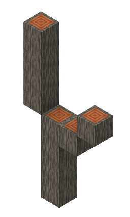

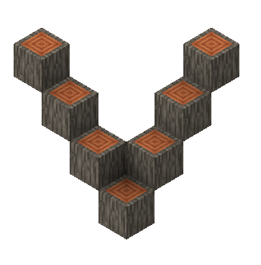

这意味着我们无法通过主推移走所有的原木，对此我们需要增加**侧枝处理**。其有两种设计方案：**归中处理**、**增加原木输出**

归中处理而言，我们需要先将主推侧的原木推到中间，再将左侧的原木推到中间，由主推移出中心，最后将右侧原木推到中间，由主推移出中心
<!--这里需要一个动图-->

增加原木输出的典型案例是nutstory的架构，相信你们能通过动图理解它的工作方式。

>在一些架构中，我们会同时见到这两种处理方式，如PUTF -2。另外PUTF//给出了另一种处理思路：增加一格主推，将侧枝归中到中间2格后直接推出。但这种方式不能用于樱花树，在GTMC所处的1.20.1并没有显著的价值

### 3.1.3 丛林架构要求

丛林的树干高度最高为**12格**，我们需要有足够高度的主推，以尽可能处理所有的原木

>事实上存在不处理全高的全树种树场，一般有8高（方便橡树限高）和10高（方便布线），但我们不提倡这种行为

丛林的树苗掉落概率为**1/40**，因此我们需要为丛林木设计额外的树叶处理。最简单的方式是使用**二次递推**，或者**蜜绿墙**尽可能处理所有可能长出的位置。一般而言，俯视情况下，5x5范围内**不超过5列**树叶无法处理，则这台树场可以获得足够的丛林树苗。

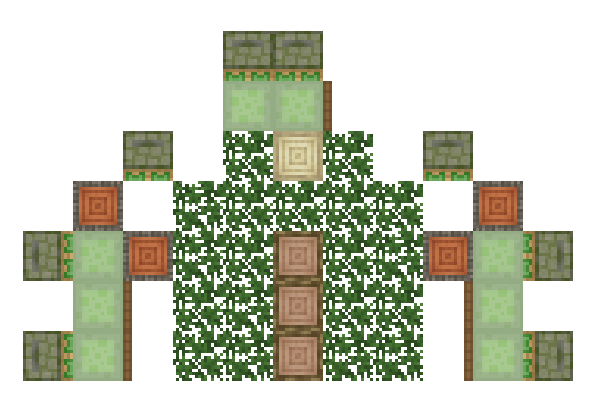

@nutstory 5列无法处理

>其实这种估算方式并不严谨，丛林树叶在靠近主干的位置分布的更密集。严格意义上讲需要计算每种树叶生长情况下处理量的平均值，一般而言大于42即可获得足够的丛林树苗

### 3.1.4 橡树架构要求

由于橡树会随机地长出**大橡树***俗称鸡腿树*，我们需要对橡树进行限高，以避免这种情况。限高方块位于**泥土上第9格**。

>事实上能直接处理鸡腿树的架构和树场是存在的，但是目前为止我们无法使其获取足够的丛林树苗，因而不在全树种树场的讨论范围内

这里我们举例采用主推**蜜绿三次递推**、侧枝**归中处理**、树叶处理**蜜绿墙**、限高手放黑曜石

>熟悉老树场的同学应该会发现，这几乎就是PTHSUTF的架构。事实上，由于械电设计方式繁杂，最好的学习某种设计的方式就是“模仿”。某种意义上，可以说在械电的学习阶段，不要忌讳“抄”，能够抄一遍优秀作品的布线，你都可以学到很多

## 3.2 方块流转掉落物架构设计

由于全树种树场较为特殊的方块流输出，我们需要对方块流进行**重组**，再送入特殊设计的爆炸室

### 3.2.1 重组

我们举例的设计而言，所有的原木都会被输出到主干正面，每一个运行周期至多输出两格。

熟悉DLHSUTF/PTHSUTF/DLPTUTF的同学应该能立刻想到直接使用**两排并排的活塞**，将目前还不知道间隔的两次原木输出转化为一个2宽的原木输出。另外我们可以用一个类似**侧吸底座**的结构，将不确定间隔的两次原木输出转化为确定间隔的两次原木输出（*一般为6gt*）

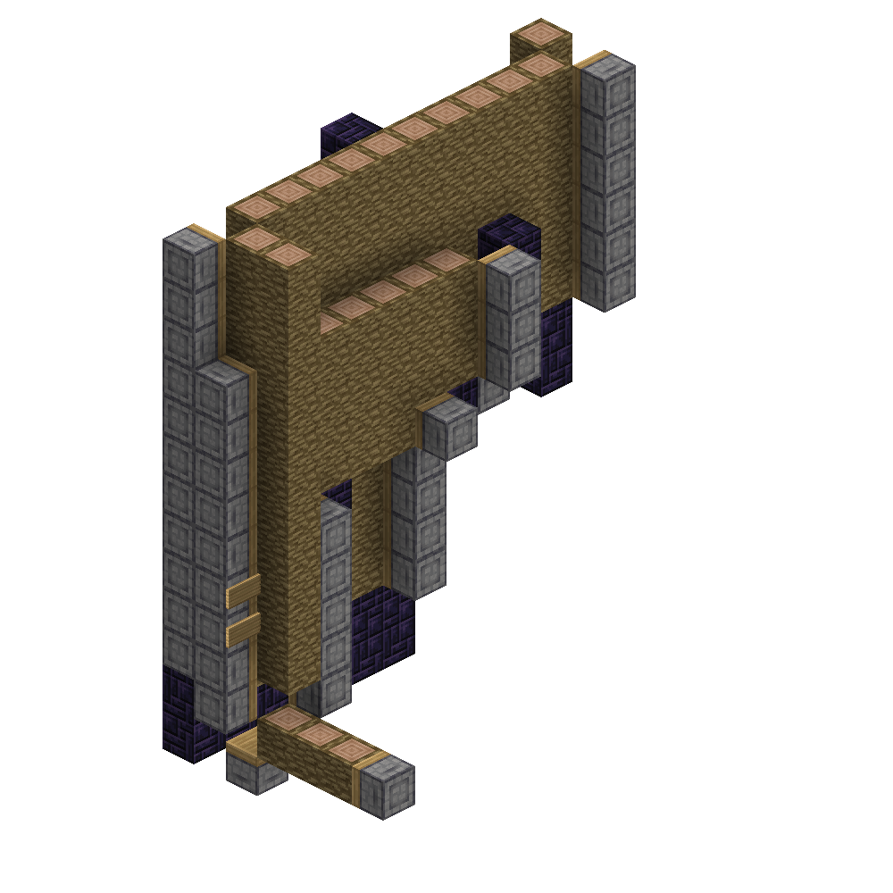

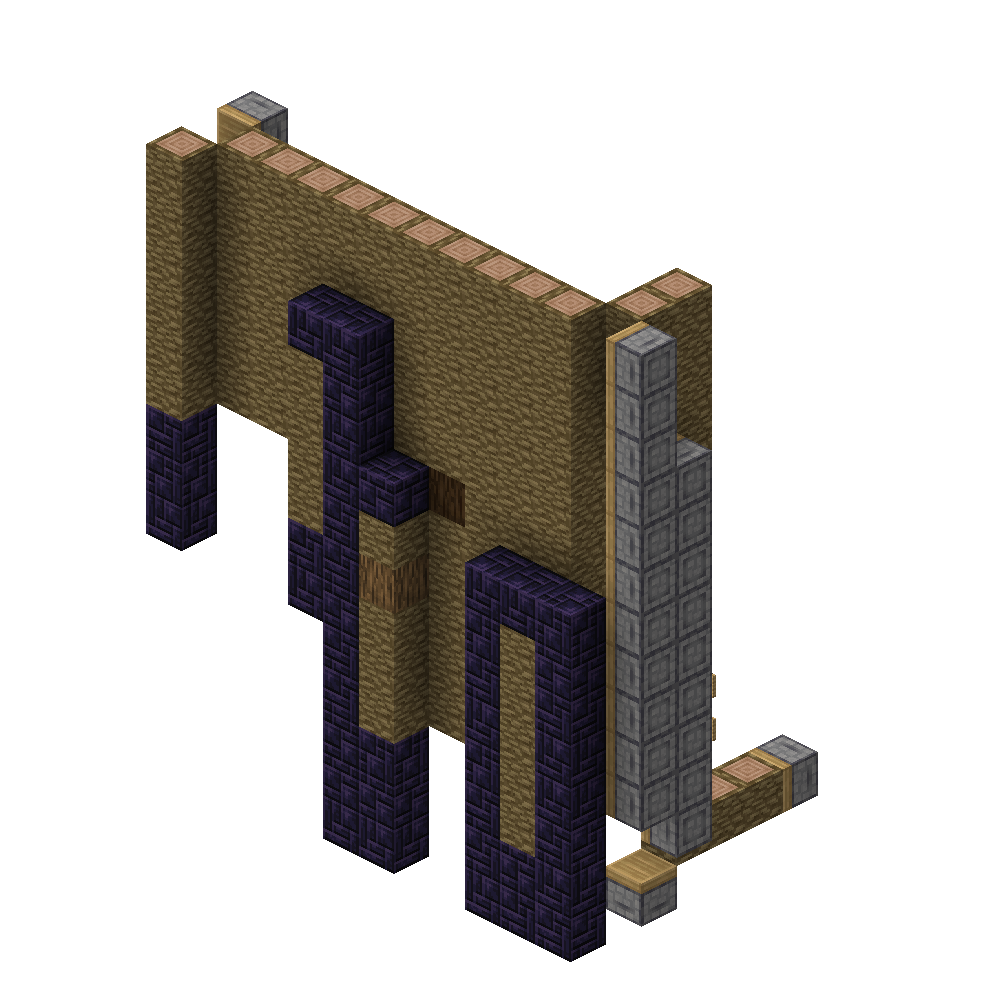

@Dawnemo DLPTUTF

>由于金合欢同y的两个原木可以分布在中心与其周围1格（如下图），即便增加原木输出，主干也需要使用这类重组。对于额外的原木输出，我们可以简单的添加爆炸室解决它们的方块流转掉落物问题

### 3.2.2 爆炸室

这里我们先随便挂一些爆炸室处理方块流，不过我们尽量不同时推出两格厚的方块流，因为**这样会极大地影响爆炸室的处理效率和最后的掉落物回收率**

>事实上对于全树种，我们可以引入**纯牛奶爆炸室**（俗称“奶爆”）和**b36爆炸室**（俗称“推爆”）两种较为特殊的爆炸结构，以应付大量不甚规则的方块流。这种方式已经在现代高速全树种得到了广泛应用，但是由于没人给我们的例子改爆炸室，我们在提速章节统一讲解（

> 奶爆：
> 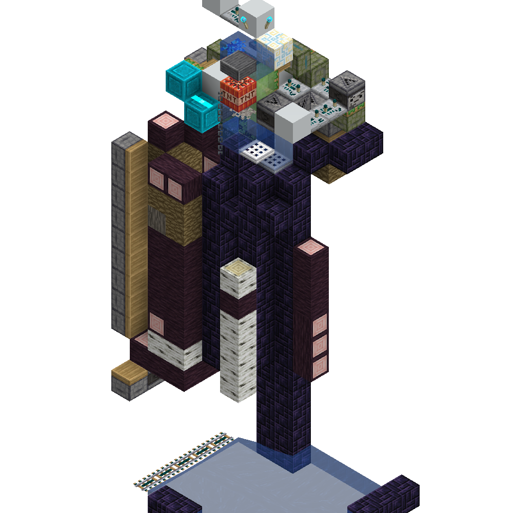
>
> @从来只喝纯牛奶
>
> @Qonctrol, Dreaming_Galaxy, BFladderbean, Feng_Bl PUTF std2
>
> 推爆：
> 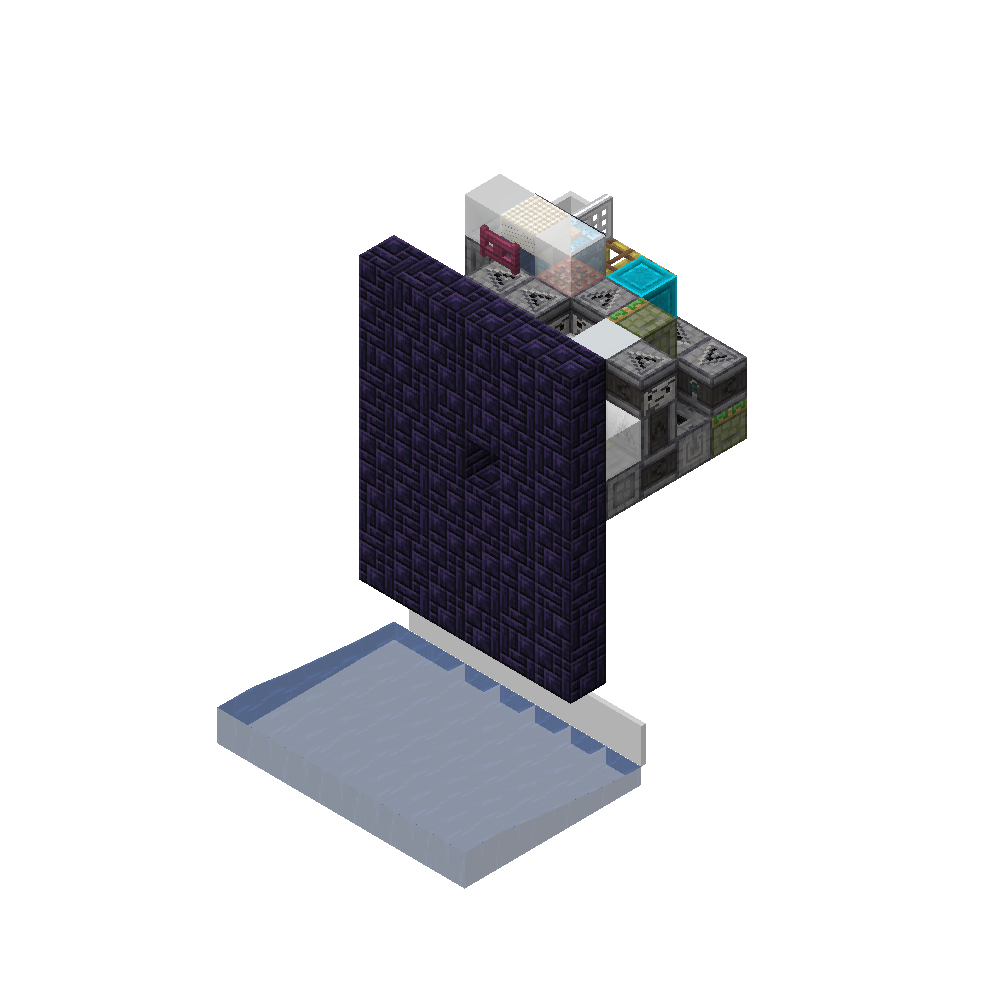
>
> @嘟了个嘟噜
<!--这里回头结合图写-->

## 3.3 布线——模式切换

其实在设计好时序之后，你只需要尽可能严格地按照你设计的时序激活各组活塞就可以了，这里我们想特别讨论**模式切换**的相关布线

### 3.3.1 金合欢时序切换

<!--在想这就讲时序切换会不会太复杂了-->
如果你有认真观察，一定可以发现：**除了金合欢，对于其他所有树种，我们都可以使两个侧面蜜绿墙（*后简称侧墙*）同时推出，从而缩短处理周期**，更进一步，我们可以让主推也同时推出，进一步缩短处理周期。这时，就产生了不同的运行时序

处理方案并不算复杂。你可以注意到，从常规的运行时序切换到金合欢运行时序，**实质上等同于为两个侧墙增加延迟**，因此我们只需要另外连一条延迟更大的线激活侧墙，并设计一个在两条线路之间切换的装置，就可以了

<!--最基本的例子是用一个活塞改变压线的位置，应该可以在我的EEUTF里面找到，不行就回头找时间手搓一台好了-->

### 3.3.2 自动橡树限高

很多人会说手放黑曜石太麻烦了。这当然是有解决方案的：自动限高

由于不同树场自动限高的方式有很大差别，这里只讲解我们举例的架构使用的自动限高

可以发现，我们只需要将一个**不能被主推推动的方块**放到对应的位置，就可以达成限高的效果，但为了通过某种方式（一般是飞行器）将这个方块送下去，我们只能使用可推动的方块。解决方案是，在主推的推动方向上填满原木，在重组那边塞入一个**激活的活塞**从而阻碍主推方向上这个方块的移动。

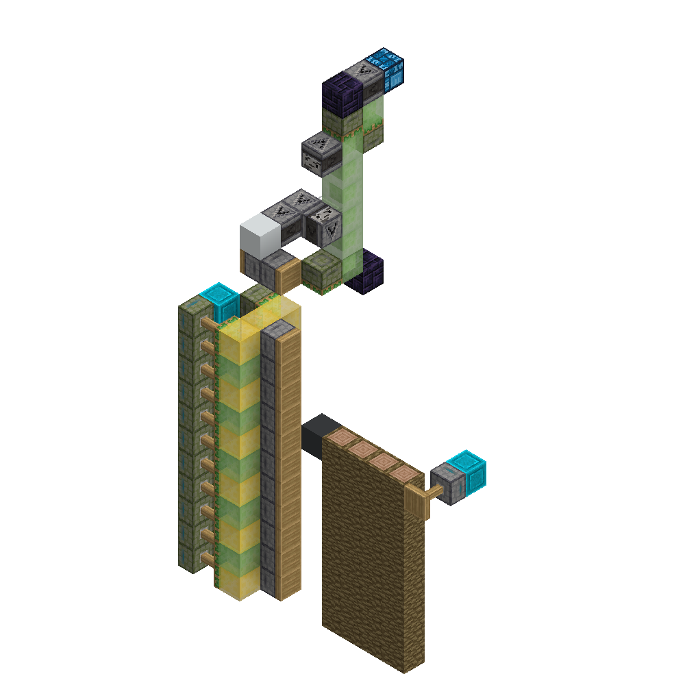

>主干使用蜜绿二次递归的架构可以用飞行器送一个陶瓦下去，并移除主推上对应高度的原木，详见PUTF standard。
>
>当然也有一些其它方案，在这里举个例子：
> 切史莱姆棒子的：
>
> 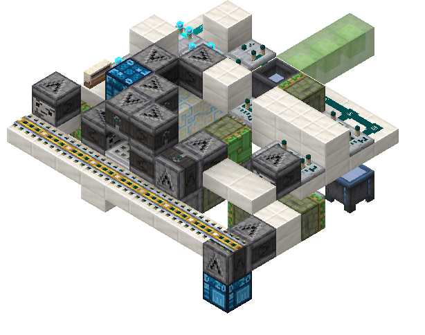
>
> @Jellie_
>
> 飞陶瓦的：
>
> 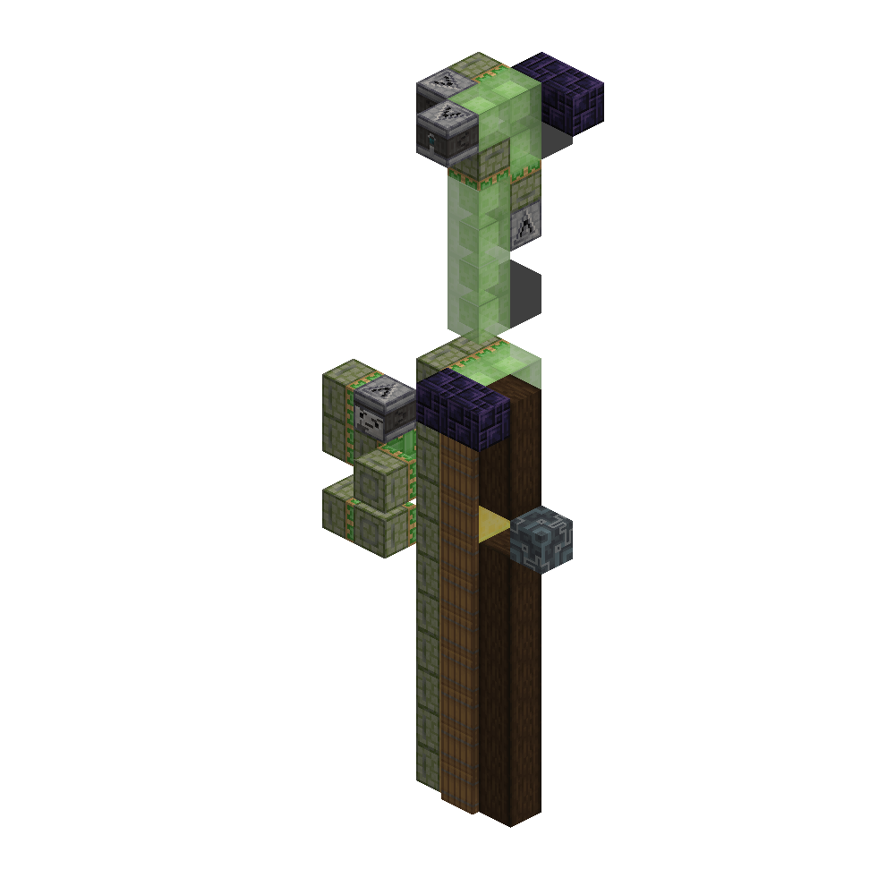
>
> @XJH_Jorhai
>
> 切墙主推飞飞行器下去直接塞的：
>
> 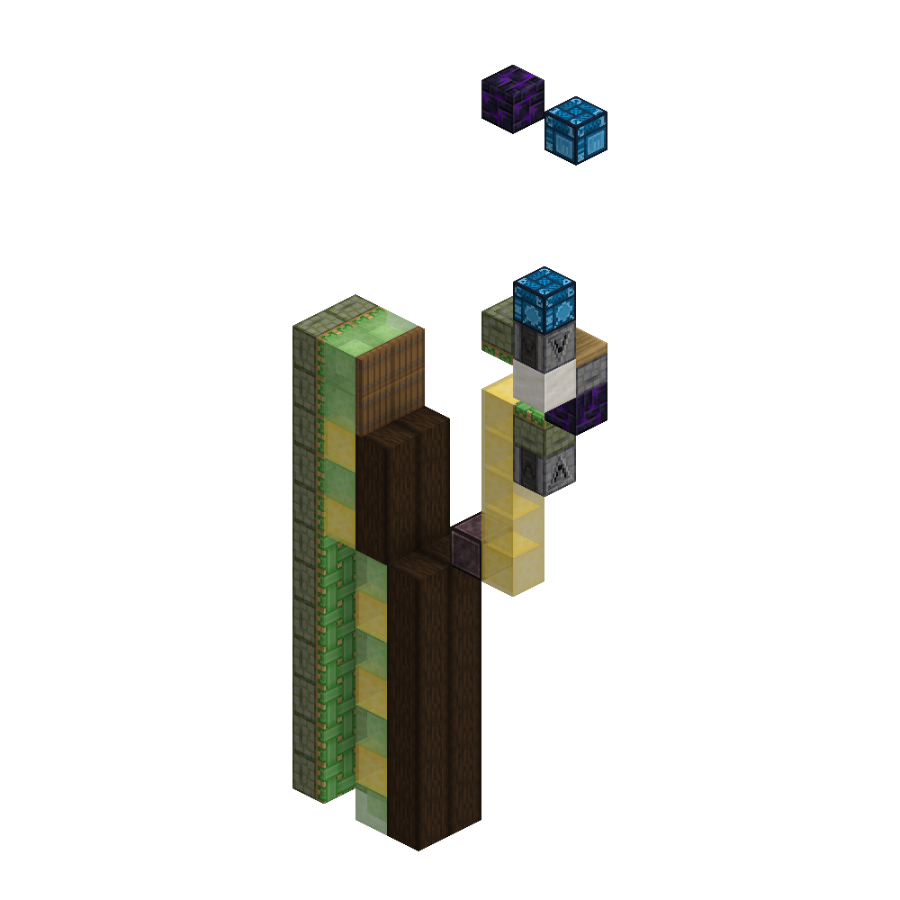
>
> @Feng_Bl

### 3.3.3* 丛林与金合欢增高（1.14及以下内容）

在1.14及以下版本中，丛林与金合欢的生长检测为**树干3x3，树冠5x5**，因此我们可以在某个高度以下（*一般是泥土以上5格*），向5x5以内塞入一些方块，从而使低于一定高度的丛林和金合欢被**强制增高**到一定高度，从而提升这两种树的效率

>由于增高的机制事实上是禁止低于一定高度的丛林或金合欢长出，所以它会增加骨粉消耗。另外，即便在1.20.1中，深色橡木也保留了相同的生长要求（以西北角树苗为中心），因此我们依然可以“增高”深色橡木

至此，我们就完成了一台相对简单的全树种树场。
<!--回头得搓一台作为例子，然后把存档扔在这里>