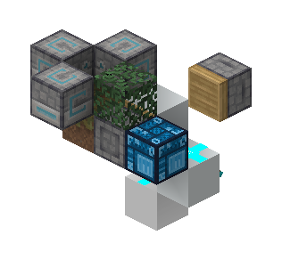
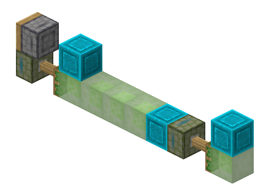
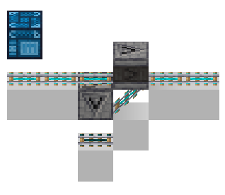
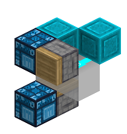
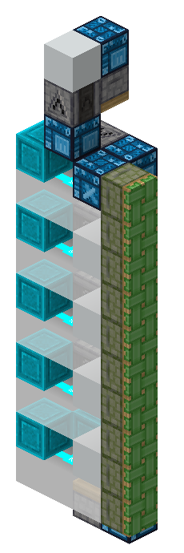
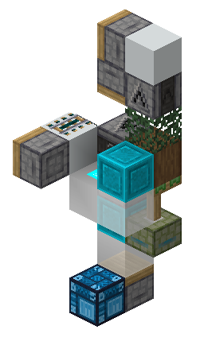

# #05 为什们你的树场卡——无粉布线简介

相比不少人已经等候多时了。无粉树场近些年来似乎是相当好的一个“装逼”途径。然而，星河一直强调：

>无粉从来都不是目的，而是手段。最终目标应当是减少卡顿，而不是强行无粉。强行无粉很容易导致卡顿上升，这与无粉的根本理念是背道而驰的

明白这一点，我们才能真正用好无粉布线

接下来，我们一点一点阐述无粉布线的主要方式

## 5.1 铁轨与侦测器

众所周知，铁轨在激活状态改变的时候会**同时发出PP更新**，并可以被侦测器检测。铁轨与侦测器就能构成最基础的无粉信号传递方式<!--记得补图-->

树场中，活塞一般是纵向排布的，我们只需要同时激活纵向的一排侦测器，就可以同时激活整排的活塞。最基本的有两种方式：通过活塞**推动侦测器本身**或**推动侦测器面对的方块**~~这一排东西的归位随便做一下就好了~~<!--记得补图-->

由于侦测器自带2gt延迟，我们可以利用它构造宏观时序。这个方向的例子已经有很多，不再进行具体分析

## 5.2 树电/脚电/墙电

*其实还有个水电但因为没人用我们这里就忽略它好了*

### 5.2.1 树电

众所周知，从1.14开始，在接收到PP更新后，树叶会添加一个计划刻（如果在TT，则立刻执行，否则在**1gt后的TT**执行）检查自己到原木的距离。如果距离发生改变，则发出**NC和PP更新**。在树场中，我们一般通过活塞或粘液块推拉原木，实现距离的改变

>事实上树电的更新方式有点像红石粉：它检查四周的原木和树叶的distance，如果毗邻有原木，则将自己的distance设置为0；如果四周没有原木，则将自己的distance设置为毗邻的树叶中最小的distance+1

通过树电，我们可以造出非常多好用的**奇数gt延迟**装置，比如让上推柱子在3gt开始下推

>树电检测，就是利用树电在TT内无延迟的特性。树场的催熟模块是**运行在TT内**的，因此，树必然在TT内长成，并放置原木。因此，树叶会在TT内立刻执行检查，然后发出NC和PP更新，从而触发BUD，实现生长检测。不过由于空间问题，现在几乎不再使用。
>
>

### 5.2.2 脚电

众所周知，当一个脚手架接收到PP更新后，会添加计划刻，检测自身与支撑方块的**水平距离**，若距离改变（且不大于6，大于6会掉落），发出NC和PP更新。脚电会在**每一个脚手架上增加1gt**的延迟。 一般而言我们通过脚手架下**活版门的状态变化**触发脚电

一般而言我们用脚电制造**奇数gt延迟**~~和树电看着像就对了，使用场景是几乎一样的~~

>脚电和树电一样运行在TT内，如果能在TT内确认自身与支撑方块距离的改变，理论上是可以实现无延迟的。不过脚电在目前的实际应用中还显得比较玄学（

### 5.2.3 墙电

众所周知，从1.16开始，x或z轴上均有连接方块，则石墙为低墙，否则为高墙。若一整列石墙中有一个高墙，则从其开始，其下所有墙都为高墙（低墙不会覆盖）。我们一般通过最上方墙**上方的栅栏门的开关**或**侧面的门/活版门的开关**实现墙的状态变化。

另外，墙会主动连接**上方的某些方块**，是否连接也是一种墙的一种状态，可以用于将方块流转向上方向

墙是**瞬时原件**，所有墙的状态变化都会发出**PP更新**，并被侦测器侦测。

>推动墙的连接方块甚至墙本身的设计也是有的，特别用于单边沿墙电。以上更详细的内容可以参考[东东的视频](https://www.bilibili.com/video/BV1Zy4y117DC)

## 5.3 无宏观延迟的信号传递

上面说的信号传递方式都是**有宏观延迟的**。如果你在上一章之后尝试了布线，你应该会发现**我们很需要无宏观延迟的信号传递方式**。这里，我们简单了解无粉布线中最重要的两种无宏观延迟延迟的信号传递方式

### 5.3.1 粘液棒子

粘液棒子顾名思义，就是用粘液块拉动一些东西完成信号传递。众所周知，活塞在推拉一串方块的时候，**会在BE阶段内就删除原本位置的方块**，因此**可以在同gt内改变另一个活塞的激活状态**，从而消除宏观延迟

这样串出来的棒子，对于其中的粘性活塞，**传递下降沿无宏观延迟，而上升沿会有每个活塞3gt的延迟**，怎么办呢？一般而言，我们会为每一根棒子添加一个自复位装置，在3gt的时候自动复位，这样就可以让它们同步复位，**同步输出上升沿信号**

### 5.3.2 铁轨+BUD

还记得铁轨是瞬时原件吗？利用铁轨更新bud，bud再改变另一串铁轨的激活状态，我们就可以让信号一直在BE阶段内传递

这样的结构一般而言同样是下降沿无延迟（*因为在无粉环境下，我们唯一一个可以无延迟输出上升沿的布线方式较为复杂*）而自复位输出上升沿的

>其实对于BUD而言，它需要的只是更新，而与上升沿或下降沿信号无关，这里的表述只是为了与前文统一

## 5.4 红石粉重定向

*由于它的英文是Redstone Redirection，我们不使用常见的“转向”作为翻译*

这就是刚才所提到的**无粉环境下唯一可以无延迟输出上升沿信号的方式**

众所周知，红石粉**只会向指向的方向充能**，因此只要创造一个**有能量，不指向某个方向**的红石粉，在输入上升沿信号时，**使它重定向而指向某个方向**，就可以向那个方向无延迟输出上升沿信号。

众所周知，红石粉会被以下方块重定向：

- 中继器、比较器、绊线钩 *不可推动*
- **红石块、侦测器、标靶、避雷针、探测铁轨** *可推动*

其中**可推动的**就是我们最重要的实际使用红石粉重定向的方式

需要注意的是，红石粉的重定向**只包含PP更新**，要用于激活某些部件，我们需要**额外提供NC更新**

下面我们简单介绍几个基于红石粉重定向的在树场中被**大量使用**的部件

### 5.4.1 柱子

非常简单，我们将若干红石粉重定向纵向排列，你能很自然的想到将重定向用的方块纵向排列，并在纵向上移动

这样我们就轻松获得了一整列**同步**的红石粉重定向，从而轻松地激活一整排活塞。

### 5.4.2 3gt发生器

这是一个标准的3gt发生器

`0gt BE`，更新上推红石块柱子的活塞，红石粉**重定向并指向需要充能的方块**；上方的铁轨受到柱子推动提供的NC更新，被激活，向活塞柱子发出NC更新；活塞响应NC更新，推出

`2gt TE`，红石块柱子到位，被充能的活塞完成推出，**自检**，发现**不被充能**，创建计划收回

`3gt BE`，被充能的活塞开始收回，红石块柱子在略深一点的位置开始下推，**此时虽然充能了目标活塞，但目标活塞会优先完成收回动作**

`5gt TE`，复位，目标活塞再次自检，发现不被充能，不再推出

这样我们就完成了一次**3gt推，3gt拉**的活塞动作，这在现代蜜绿树场尤其重要

>想必你能注意到，如果我们在0gt BE不给目标活塞NC更新，而在3gt BE给，我们就能让目标活塞的动作延迟3gt。这是目前完美时序全树种采用的时序切换方案：在0gt BE和3gt BE都提供更新，由于目标活塞是二次递归的二级，由一级推动到位，它就不会受到第一次充能而推出，转为被第二次充能激活

### 5.4.3 0t发生器

这是一个简单的基于红石粉重定向的0t发生器<!--记得补图-->

总之就是在红石粉重定向充能了被充能方块，并给到NC更新使活塞推出之后，**移除被充能方块**，从而达成0t

你可以设计很多很多类似的装置，其中也包括像[5.4.1]提及的那样纵向堆叠

>事实上，由于这里只有一个单独的红石粉，直接移除红石粉的充能源——背后的红石块——来制造0t并不会带来多少卡顿（约等于3个铁轨）。如果你不追求完全无粉，这也是相当不错的布线方式

以上就是基本的无粉布线方式。再说一遍：**你自己去多扒几台/布几台比什么都强**，请务必重视自己的亲手实践